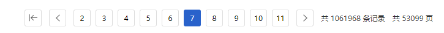
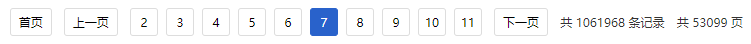
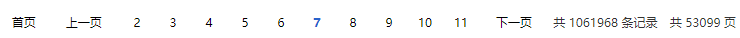
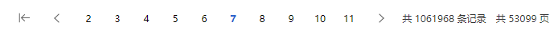
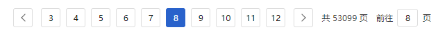

### 分页器组件(/components/pagination)

Tags：vue组件文档

> <small>基于百度的分页器组件（不提供最后页按钮）</small>

**参数**

| 参数 | 说明 | 类型 | 默认值 |
| ---- | ---- | ---- | :----: |
| small            | 是否使用小型分页样式(width: 24px;) ，正常28px            | Boolean  | false |
| background       | 是否为分页按钮添加背景色         | Boolean  | false |
| pageSize         | 每页显示条目个数                 | Number   | 10    |
| total            | 总条目数                         | Number   | 0     |
| current          | 当前页码(支持.sync)              | Number   | 1     |
| show-home-btn    | 是否显示返回首页按钮             | Boolean  | false   |
| show-total       | 是否显示总记录数                 | Boolean  | false   |
| show-total-pages | 是否显示总页数                   | Boolean  | true    |
| show-elevator    | 显示电梯，可以快速切换到某一页   | Boolean  | false   |
| homeText         | 替代图标显示的返回首页文字       | String   | -       |
| prevText         | 替代图标显示的上一页文字         | String   | -       |
| nextText         | 替代图标显示的下一页文字         | String   | -       |

**event**

| 事件名称 | 说明 | 返回值 |
| ----     | ---- | ----     |
| on-change   | 页码改变的回调，返回改变后的页码      | 页码 |


---
**样式一**

```html
// 返回首页按钮只有页码大于6时显示
<sys-page
    :total="total"
    :page-size="pageSize"
    :current.sync="currentPage"
    :show-home-btn="true"
    :show-total="true"
    @on-change="search">
</sys-page>
```

> 

---
**样式二**

```html
<sys-page
    :total="total"
    :page-size="pageSize"
    :current.sync="currentPage"
    :show-home-btn="true"
    :show-total="true"
    home-text="首页"
    prev-text="上一页"
    next-text="下一页"
    @on-change="search">
</sys-page>
```

> 


---
**样式三**

```html
<sys-page
    :total="total"
    :page-size="pageSize"
    :current.sync="currentPage"
    :show-home-btn="true"
    :show-total="true"
    :background="false"
    home-text="首页"
    prev-text="上一页"
    next-text="下一页"
    @on-change="search">
</sys-page>
```

> 

---
**样式四**

```html
<sys-page
    :total="total"
    :page-size="pageSize"
    :current.sync="currentPage"
    :show-home-btn="true"
    :show-total="true"
    :background="false"
    @on-change="search">
</sys-page>
```

> 

---
**跳转器**

```html
<sys-page
    :total="total"
    :page-size="pageSize"
    :current.sync="currentPage"
    :show-elevator="true"
    @on-change="search">
</sys-page>
```

> 
