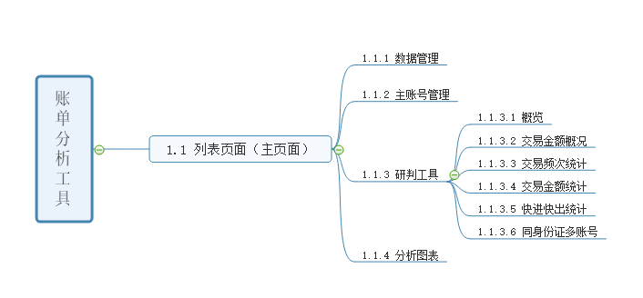

# 项目模块设计案例

[[toc]]

## 1. 页面层次导图

### 1.1 路由

- 列表页面（主页面）：/bill-analysis
- 数据管理：/bill-analysis/data-management
- 主账号管理：/bill-analysis/main-account-management
- 研判工具：/bill-analysis/tool
  
    - <small>概览：/bill-analysis/tool/overview</small>
    - <small>交易金额概况：/bill-analysis/tool/transaction-amount-overview</small>
    - <small>交易频次统计：/bill-analysis/tool/transaction-frequency</small>
    - <small>交易金额统计：/bill-analysis/tool/transaction-amount-statistics</small>
    - <small>快进快出统计：/bill-analysis/tool/fast-in-and-out</small>
    - <small>同身份证多账号：/bill-analysis/tool/multiple-accounts</small>

- 分析图表：/bill-analysis/analysis-chart

## 2. 模块组件

### 2.1 列表
    
| <small>组件概述</small>  | <small>名称</small> | <small>功能</small> | <small>公共组件?</small> |
| :----                   | :----            | :----                  | :----        |
| 容器                | AnalysisList         |账单分析列表数据预览，点击“研判”默认跳转至“研判 -> 数据管理”    | ✖ |
| <b style="color: #2962cb;">创建任务弹出层组件</b>               | CreateAnalysis         | 创建一个账单任务，并更新任务列表    | ✔ |

### 2.2 研判 -> 数据管理
    
| <small>组件概述</small>   | <small>名称</small> | <small>功能</small> | <small>公共组件?</small> |
| :----                     | :----              | :----               | :----        |
| 容器               | FileList         |数据管理列表数据预览，点击“预览”弹出“文件对应详细数据”    | ✖ |
| 文件预览弹出层组件               | FileView         |文件对应实体数据预览    | ✖ |

### 2.3 研判 -> 主账号管理
    
| <small>组件概述</small>   | <small>名称</small> | <small>功能</small> | <small>公共组件?</small> |
| :----                     | :----              | :----               | :----        |
| 容器               | MainAccountList         |主账号列表数据预览 | ✖ |
| 添加主账号弹出层组件               | CreateMainAccount         | 添加主账号，并更新列表     | ✖ |

### 2.4 研判 -> 分析图表
    
| <small>组件概述</small>   | <small>名称</small> | <small>功能</small> | <small>公共组件?</small> |
| :----                     | :----              | :----               | :----        |
| 容器               | ChartList         | 图表列表数据预览 | ✖ |
| <b style="color: #2962cb;">图表卡片组件</b>               | ChartCard         | 图表卡片数据展示     | ✔ |

### 2.5 研判 -> 研判工具
    
| <small>组件概述</small>   | <small>名称</small> | <small>功能</small> | <small>公共组件?</small> |
| :----                     | :----              | :----               | :----        |
| 容器        | Tool              | 研判工具模块展示 | ✖ |

### 2.5.1 研判 -> 研判工具 -> 概览

| <small>组件概述</small>   | <small>名称</small> | <small>功能</small> | <small>公共组件?</small> |
| :----                     | :----              | :----               | :----        |
| 容器        | Overview              | 研判工具模块展示 | ✖ |
| <b style="color: #2962cb;">选择主账号弹出层组件</b>        | SelectMainAccount   | 选择主账号，并更新概览数据展示 | ✔ |

### 2.5.2 研判 -> 研判工具 -> 交易金额概况

| <small>组件概述</small> | <small>名称</small> |<small>功能</small> | <small>公共组件?</small> |
| :----                | :----              | :----               | :----        |
| 容器 | TransactionAmountOverview    | 页面容器 | ✖ |
| <b style="color: #2962cb;">选择主账号弹出层组件</b>        | SelectMainAccount   | 选择主账号，并更新概览数据展示 | ✔ |
| <b style="color: #2962cb;">分析参数设置组件</b>        | AnalysisParamsSetting   | 分析参数设置 | ✔ |

### 2.5.3 研判 -> 研判工具 -> 交易频次统计

| <small>组件概述</small>   | <small>名称</small> | <small>功能</small> | <small>公共组件?</small> |
| :----                     | :----              | :----               | :----        |
| 容器        | TransactionFrequency              | 页面容器 | ✖ |
| <b style="color: #2962cb;">选择主账号弹出层组件</b>        | SelectMainAccount   | 选择主账号，并更新概览数据展示 | ✔ |
| <b style="color: #2962cb;">分析参数设置组件</b>        | AnalysisParamsSetting   | 分析参数设置 | ✔ |

### 2.5.4 研判 -> 研判工具 -> 交易金额统计

| <small>组件概述</small> | <small>名称</small> |<small>功能</small> | <small>公共组件?</small> |
| :----                | :----              | :----               | :----        |
| 容器 | TransactionAmountStatistics   | 页面容器 | ✖ |
| <b style="color: #2962cb;">选择主账号弹出层组件</b>        | SelectMainAccount   | 选择主账号，并更新概览数据展示 | ✔ |
| <b style="color: #2962cb;">分析参数设置组件</b>        | AnalysisParamsSetting   | 分析参数设置 | ✔ |

### 2.5.5 研判 -> 研判工具 -> 快进快出统计

| <small>组件概述</small> | <small>名称</small> |<small>功能</small> | <small>公共组件?</small> |
| :----                | :----              | :----               | :----        |
| 容器 | FastInAndOut    | 页面容器 | ✖ |
| <b style="color: #2962cb;">选择主账号弹出层组件</b>        | SelectMainAccount   | 选择主账号，并更新概览数据展示 | ✔ |

### 2.5.6 研判 -> 研判工具 -> 同身份证多账户

| <small>组件概述</small> | <small>名称</small> |<small>功能</small> | <small>公共组件?</small> |
| :----                | :----              | :----               | :----        |
| 容器 | MultipleAccounts    | 页面容器 | ✖ |
| <b style="color: #2962cb;">选择主账号弹出层组件</b>        | SelectMainAccount   | 选择主账号，并更新概览数据展示 | ✔ |
| 持有人列表组件 | <i>iview table</i> | 页面容器 | ✖ |

## 3. 公共组件

| <small>组件概述</small> | <small>名称</small> |<small>引用次数</small> |
| :----                  | :----              | :----        |
| 创建任务弹出层组件       | CreateAnalysis    | 1 |
| 图表卡片组件            | ChartCard    | 1 |
| 选择主账号弹出层组件     | SelectMainAccount    | 6 |
| 分析参数设置组件     | AnalysisParamsSetting    | 3 |