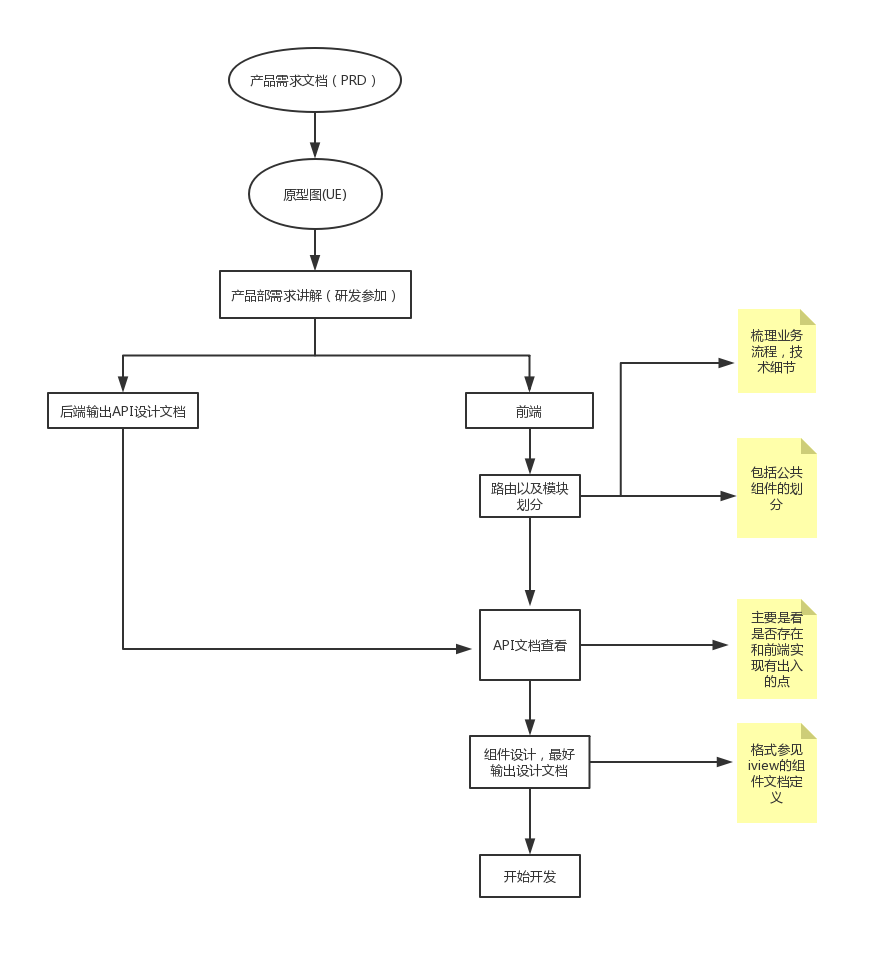
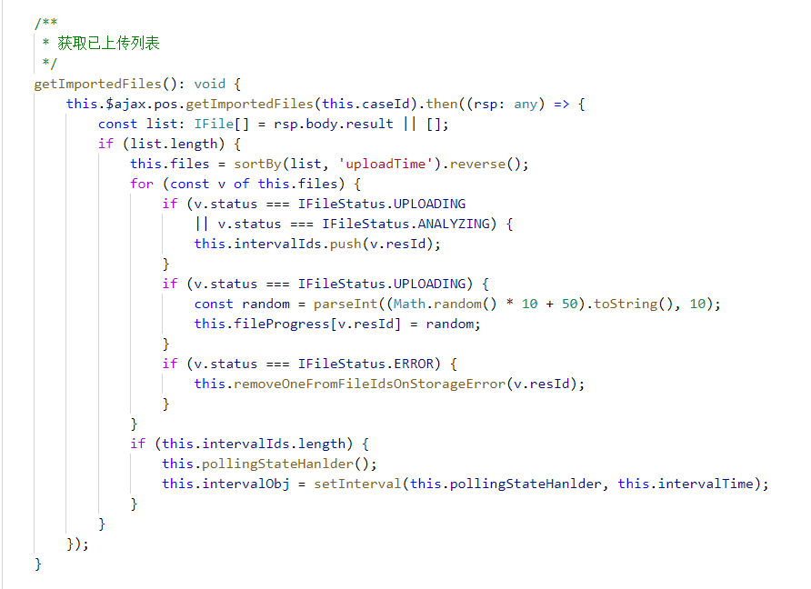
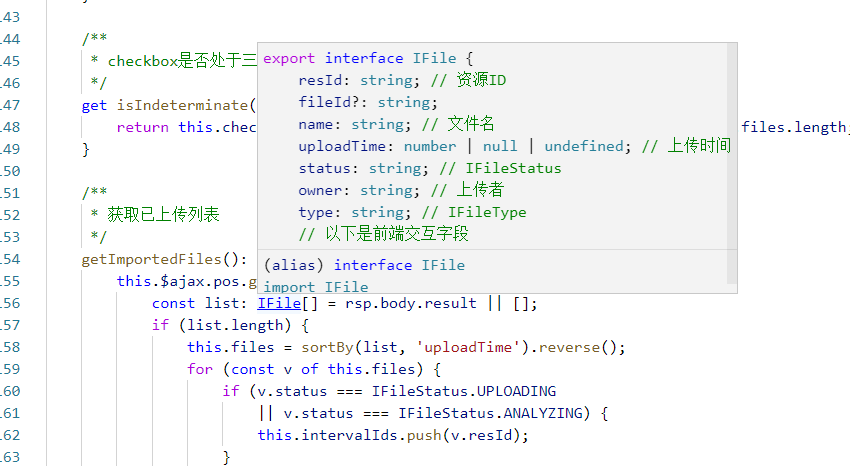
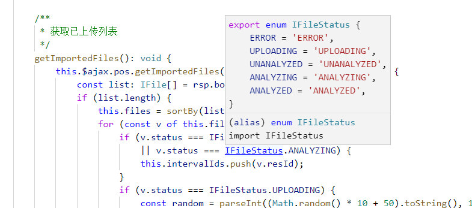
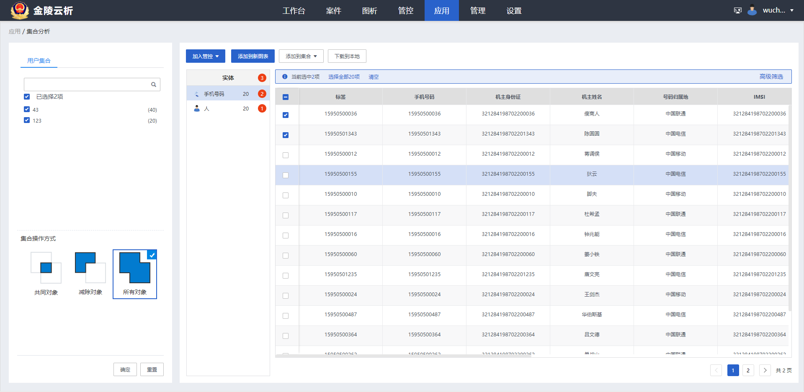
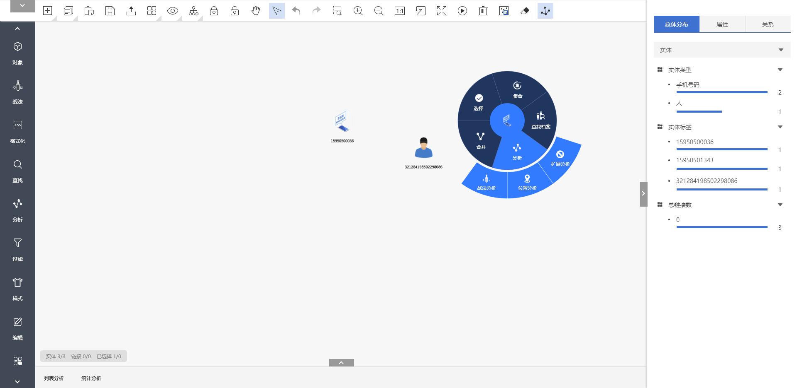

# 个人工作总结[吴超]

[[toc]]

## 1. 前言

> <small>一直觉得前端工作是一个细致活，为什么相同的任务分给不同的成员去做产生的结果大相径庭，然而这往往和能力大小没有直接关系，那和什么有关呢？两个字-<b>细心</b></small>

> <small>以下是经常会犯的错误：</small>
> 
> <small>1. 拿到原型图，稍微看一下就开始码代码（缺少思考）</small>
> 
> <small>2. 不注重代码规范，格式不友好</small>
> 
> <small>3. 忽略公共组件的设计，以及公共函数的提取、函数拆分（函数太过臃肿）</small>
> 
> <small>4. 踩过的坑不及时总结（可以写成文档，加以记录）</small>
> 
> <small>5. 缺少技能分享（不一定以会议的形式，可以写文档分享）</small>

## 2. 项目工作流程

## 3. 一些总结

- 3.1 <small>[工作方式](../study/about-work.md)</small>

- 3.2 <small>利用typescript 增强代码的可阅读行</small>
  - <small>[ts使用1](../study/vue-support-typescript.md)</small>
  - <small>[ts使用2](../study/vue-cli3-use-typescript.md)</small>
  - <small>[ts使用3](../study/vue-cli3-ts-file-edit.md)</small>
  - <small>ts效果展示：</small>
  - 
  - 
  - 

- 3.3 <small>[js代码规范](../specification/javascript-style-guide.md)</small>
- 3.4 <small>[vue代码规范](../specification/vue-style-guide.md)</small>

## 4. 组件设计文档案例

- <small>[模块划分](../design/project-design-demo.md)</small>

- <small>[组件设计文档](../design/pagination-component-API-document.md)</small>

## 5. 项目展示（内网项目，无法访问）

- 
- 
- 