# 关于brackets

标签（空格分隔）： ide

---

  
  > <small>[Brackets](http://brackets.io/) 是一个免费、开源且跨平台的 HTML/CSS/JavaScript 前端 WEB 集成开发环境 (IDE工具)，支持 Windows、Linux 以及 OS X 平台。Brackets的特点是简约、优雅、快捷！它没有很多的视图或者面板，也没太多花哨的功能，它的核心目标是减少在开发过程中那些效率低下的重复性工作，当然你也可以使用其他优秀IDE（只是个人喜好）</small>
  
 1. **关于brackets设置**

 2. 同sublime text，修改配置文件即可，例如调整缩进为两个空格（1个tab等于两个空格），步骤如下：
    调试 -> 打开配置文件

    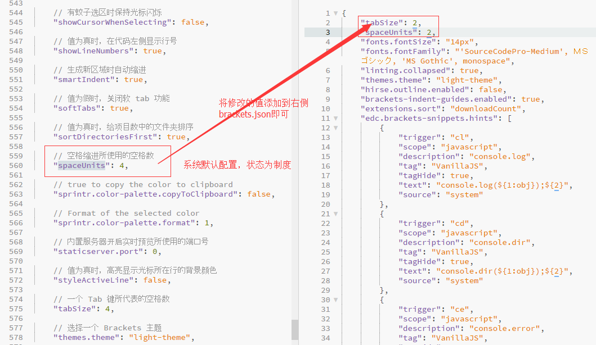
  
-----
  **一些实用插件**

 1. [Custom Work](https://github.com/DH3ALEJANDRO/custom-work-for-brackets)
    优化tab标签视图

    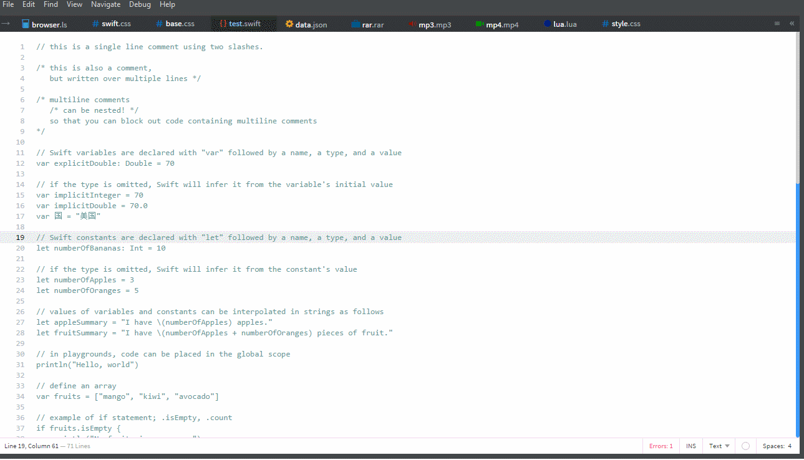

 2. [Indent Guides](https://github.com/lkcampbell/brackets-indent-guides)
    缩进标记线条

    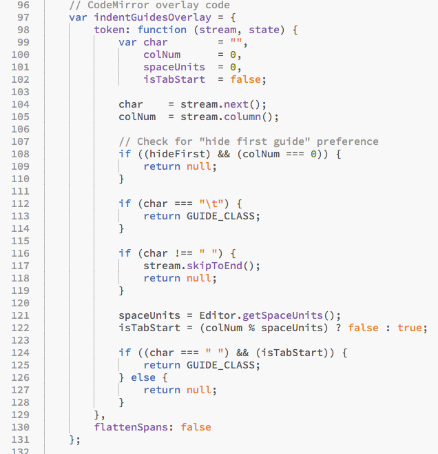

 3. [Brackets-Git](https://github.com/zaggino/brackets-git)
    集成git工具

    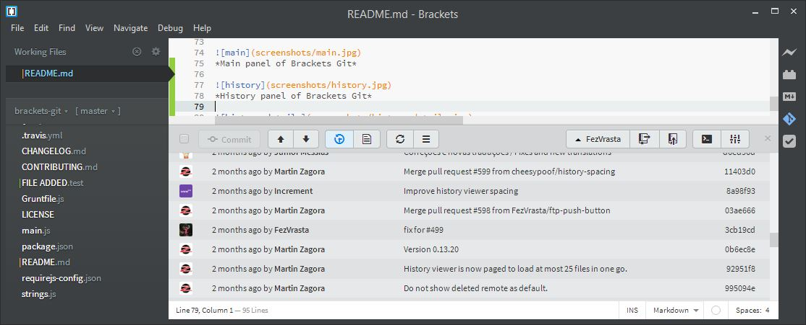
    
    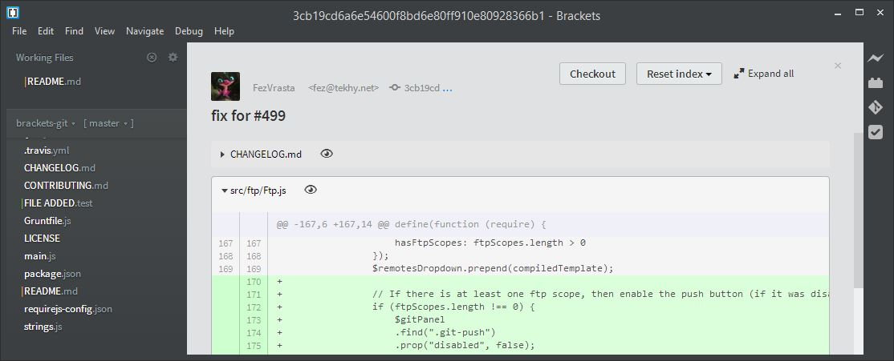
    

 4. [brackets-beautify](https://github.com/brackets-beautify/brackets-beautify)
    
    按规范一键格式化代码（CTRL+ALT+B）

 5. [Get Current File Path](https://github.com/hil400k/get-active-file-path)
    获取文件相对路径（CTRL+`）
    

 6. [Inline Image CSS or HTML Image Tag](https://github.com/vinliangx/brackets-image-inline-css)
    
    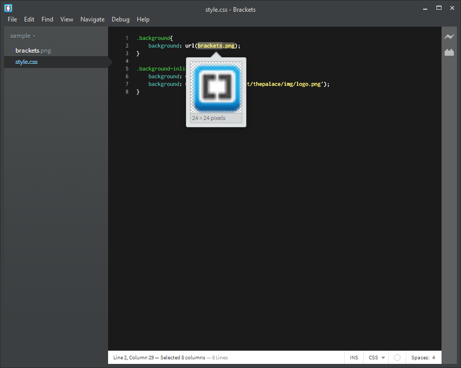

    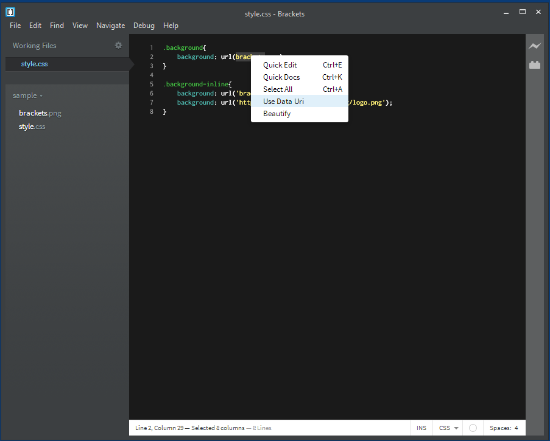
    
    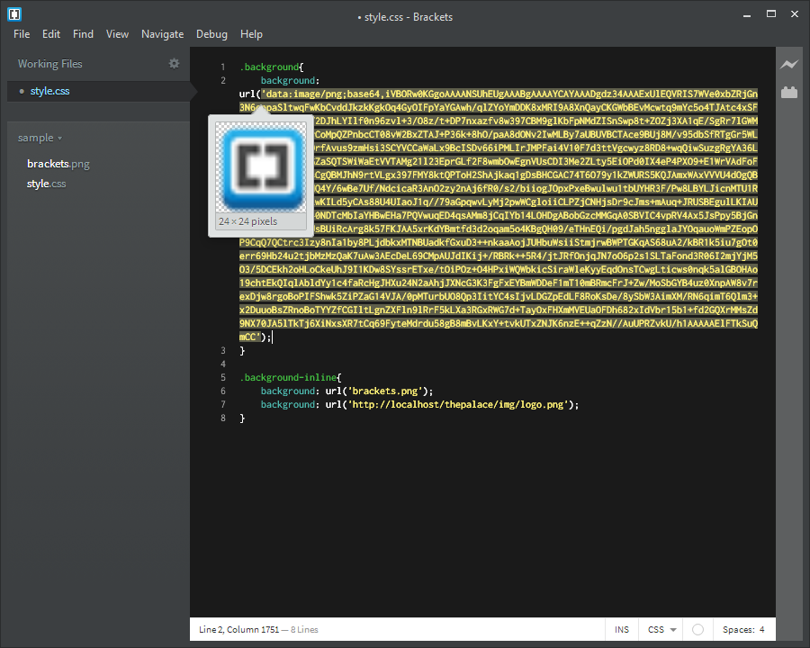
    

 7. [JSHint](https://github.com/cfjedimaster/brackets-jshint)
    
    代码检查
    
    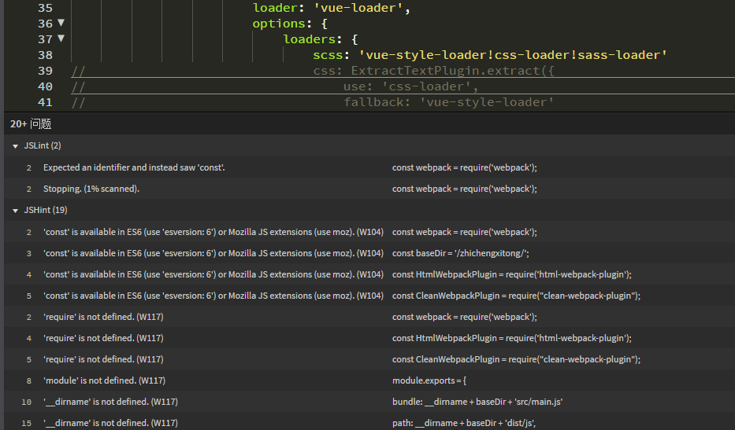

 8. [brackets-postman](https://github.com/dnbard/brackets-postman)
    
    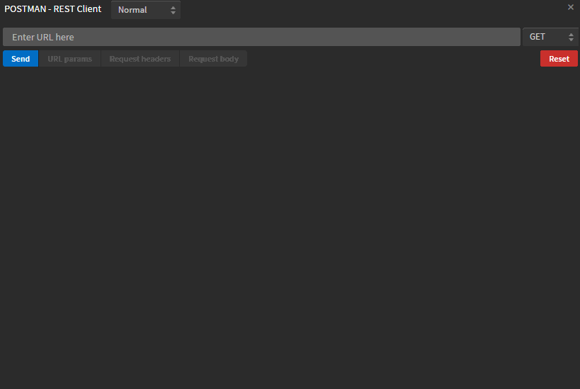

 9. 快速查找文档
    
    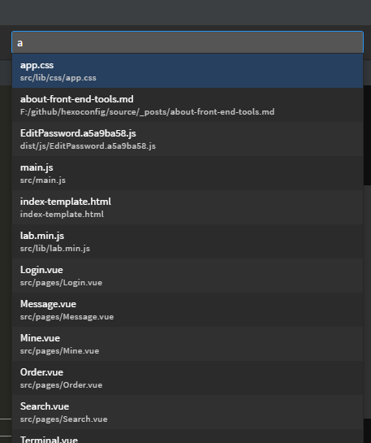

 10. 文档编写提示 [brackets-FuncDocr](https://github.com/wikunia/brackets-funcdocr)
    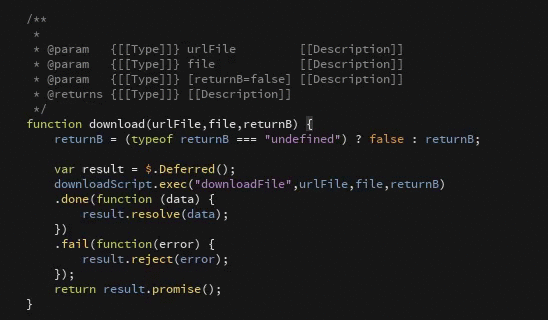
    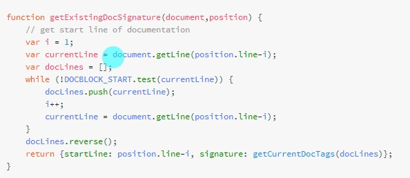

 11. 代码自动补全（可自定义）[brackets-snippets](https://github.com/chuyik/brackets-snippets)
    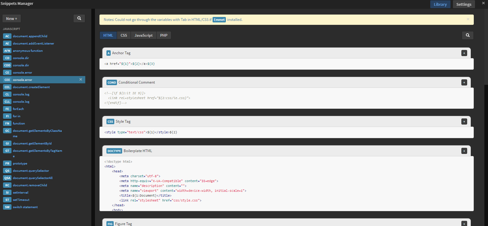
    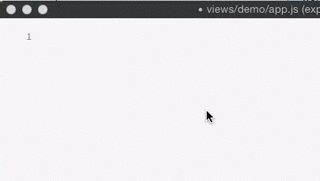
    
 12. less、scss 颜色快速拾取[swatcher](https://github.com/FreaKzero/brackets-swatcher)
    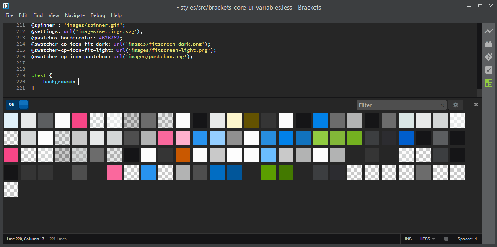

 13. [emmet](https://github.com/emmetio/brackets-emmet)

