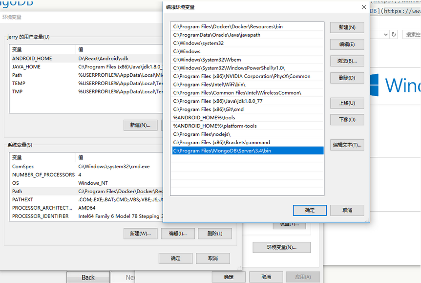
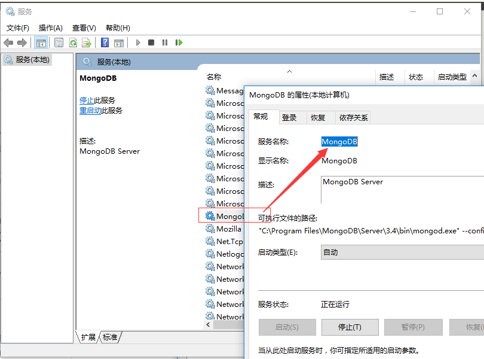
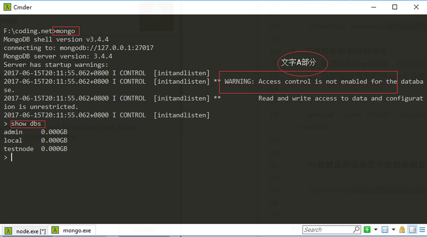
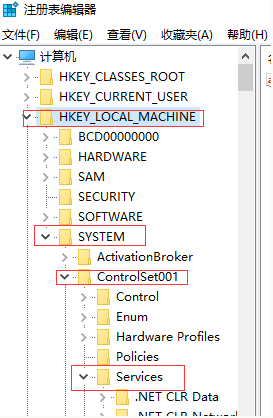
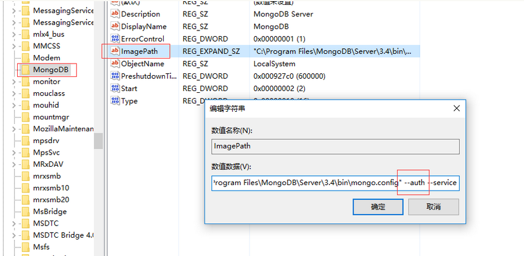
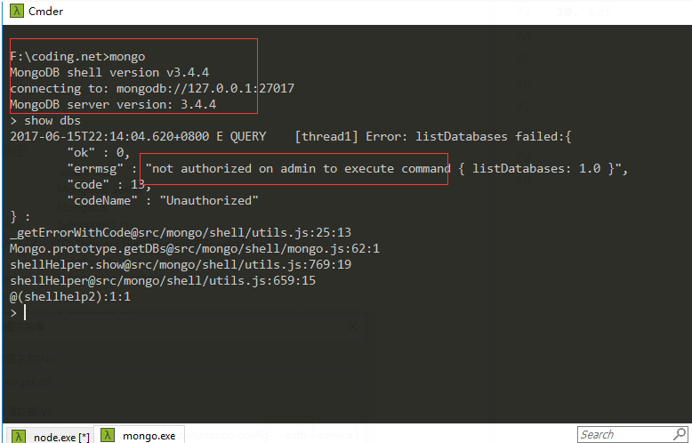

# nodejs操作mongoDB

Tags：mongoDB

### 安装[mongoDB](https://www.mongodb.com/download-center#community)(windows)

1. 点击下载[mongoDB](https://www.mongodb.com/download-center#community)安装包

2. 安装过程中选择custom
    
    

3. 安装完成，请添加系统环境变量
    
    

4. 注册服务到系统服务中
    a) 建立db和logs目录，比如在D盘中新建"mongoDB\data\db"和"mongoDB\logs\mongodb.log"
    b) 以管理员身份打开cmd命令提示框，执行以下代码注册系统服务

    ```java
    mongod --port 27017 --dbpath "D:\mongoDB\data\db" --logpath "D:\mongoDB\logs\mongodb.log" --install
    ```
    
    ```java
    //卸载服务的代码（这里不需要执行，仅供参考）
    mongod.exe --remove --serviceName "MongoDB"
    ```
    
    **此时去系统服务中查看发现会多出mongoDB服务，之前是没有的**
    
    
    

5. 启动刚才注册的服务，此时随便打开一个命令行工具（无需管理员身份）
    
    输入mongo回车，连接到momgo
    输入show dbs，如下图显示，表示安装成功！

        

6. 仔细看会发现有文字A部分提示，指的是当前未设置数据库访问权限

7. 给数据库添加超级管理员账号（在步骤5的基础上）
    
    **先输入use admin，回车**，然后执行以下代码    

    ```java
    //user：用户名
    //pwd：密码
    //roles: 角色，具体参考mongoDB官网文档
    //readWrite 权限
    db.createUser( {user: "tester", pwd: "123456", roles: [ { role: "dbOwner", db: "admin" }, { role: "clusterAdmin", db: "admin" }, { role: "readAnyDatabase", db: "admin" }, "readWrite" ] } );
    ```
    
    ```java
    //或者以下代码
    db.runCommand({ createUser: "tester", pwd: "123456", customData: { employeeId: 65 }, roles: [ { role: "dbOwner", db: "admin" }, { role: "clusterAdmin", db: "admin" }, { role: "readAnyDatabase", db: "admin" }, "readWrite" ], writeConcern: { w: "majority" , wtimeout: 5000 } })
    ```
    
    接着**输入show users**回车，检查添加的账号
    
8. 还没完，接着给mongoDB服务添加访问权限
    运行-> 输入regedit

    
    
    找到mongoDB，编辑image，添加--auth参数，确定
    
    
    
    **接着重启mongoDB服务**（基于步骤4）
    
9. 验证权限
    
    

    如上图出现权限提示，表示添加成功

10. 如何授权添加的账号
    
    **依次执行代码**，结果为1表示授权成功，授权成功后再次输入show dbs，成功显示数据库列表！
    ```javascript
    use admin;
    db.auth('tester','123456');
    ```
    
### nodejs链接mongoDB

1. 先使用[express-generator](http://www.expressjs.com.cn/starter/generator.html)生成一个nodejs简单应用
    
2. 使用npm提供的[mongoose](https://www.npmjs.com/package/mongoose)服务（npm install mongoose）

### mongoose解读

1. 测试连接
  ```javascript
    var mongoose = require('mongoose');
    var db = mongoose.createConnection('localhost', 'dbname');
    db.on('error', console.error.bind(console,'连接错误:'));
    db.once('open',function(){
      console.log('ok');
    });
  ```

2. Schema（相当于创建table定义，设置字段和类型以及默认值，mongoDB对应的是collection）
  ```javascript
    var PersonSchema = new Schema({
      name: { type: String, default: 'hahaha' },
      age: { type: Number, min: 18, index: true },
      bio: { type: String, match: /[a-z]/ },
      date: { type: Date, default: Date.now },
      buff: Buffer
    });
  ```
  
3. Model（建立Schema对象，指向具体的collection对象）
  ```javascript
    var MyModel = mongoose.model('Person', PersonSchema);
  ```
  
4. 使用MyModel创建集合（collection不存在时才会创建），并向集合中添加一条记录
  ```javascript
    var instance = new MyModel({
        name: 'jack',
        age: 28,
        ...
    });
    instance.save();
  ```
  
  接着在命令行工具中执行db.**people**.find({})可以查看到刚才的记录；
  **这里有个小问题**，为什么刚才定义的"**Person**"会变成"**people**"，原因是mongoose会把**单数名词**改成**复数名词**
具体规则参照 [mongoose model rules](http://www.tuicool.com/articles/R36bMbA)

5. 查找记录
    
  ```javascript
  MyModel.find(function(err,persons){
      console.log(persons);
  });
  ```
  
----
> **待更新**
