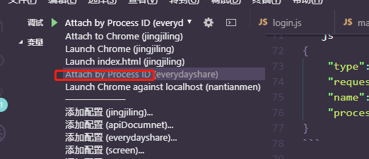

### vscode 调试chrome/node

标签（空格分隔）： vscode


#### <b>1. chrome</b>

#### Step1: add "Debugger for Chrome" plugin


#### Step2: 选择调试模式，如下图：


#### Step3: 修改配置：


```javascript
// 将上图配置项（红框中的内容）修改成以下内容：
{
    "type": "chrome",
    "request": "attach",
    "name": "Attach to Chrome",
    "port": 9222,
    "webRoot": "${workspaceFolder}"
},
{
    "type": "chrome",
    "request": "launch",
    "name": "Launch Chrome",
    "url": "http://localhost:8083", // 端口依据项目而定
    "webRoot": "${workspaceFolder}"
},
{
    "name": "Launch index.html",
    "type": "chrome",
    "request": "launch",
    "sourceMaps": false,
    "file": "${workspaceRoot}/dist/index.html"
}
```

#### Step4: 打上断点，选择配置项进行调试：


<small><b>然后按下F5，即可开启调试，如果进入不了断点，刷新页面即可</b></small>

#### Step5: 调试界面：


---

#### <b>2. nodejs</b>

#### Step1: 不需要安装其他插件

#### Step2: 同上，选择nodejs模式

#### Step3: 修改配置，步骤同上

```js
{
    "type": "node",
    "request": "attach",
    "name": "Attach by Process ID",
    "processId": "${command:PickProcess}"
}
```

#### Step4: 启动node 服务


#### Step5: 选择配置，进行调试（同上）




#### Step6: 浏览器访问需要调试的页面，下面是调试成功界面


