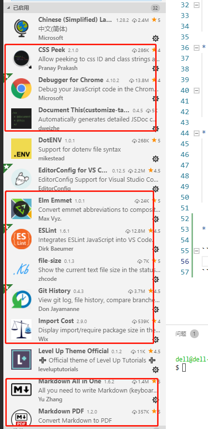
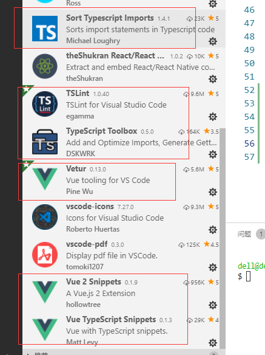

### vue-cli3 && typescript使用教程

> * <small>相对于vue-cli2, vue-cli3直接支持typescript语法</small>
> * <small>下面将如何初始化以及使用，做简单介绍</small>
> * <small>[vue-cli3](https://cli.vuejs.org/zh/guide/)文档</small>

* <b>1. 安装vue-cli3</b>

    ```bash
    npm i -g @vue/cli
    ```
    <small>TIPS: vue-cli2：</small>

    ```bash
    npm i -g vue-cli
    ```

* <b>2. 创建一个项目</b>
  
    <small>1. [使用命令行创建](https://www.jianshu.com/p/5e13bc2eb97c)</small>

    ```bash
    vue create projectName
    ```

    <small>2. [使用GUI创建](https://segmentfault.com/a/1190000015366009)</small>

    ```bash
    vue ui
    ```

* <b>3. 启动服务</b>
  
    <small>第二步完成，然后启动服务</small>

    ```bash
    npm run serve
    ```

* <b>4. 改造vue文件，使用ts文件代替</b>

    <small>推荐您使用vscode进行基于ts项目的开发，支持相对比较完善</small>

    <small>项目中经常会出现.vue文件行数过多，这样的情况会造成阅读障碍，怎么解决？</small>

    <small>[详细请看这里](./vue-cli3-ts-file-edit.md)</small>


* <b>5. 附：vscode插件推荐（vscode搜索插件即可）</b>

    

    